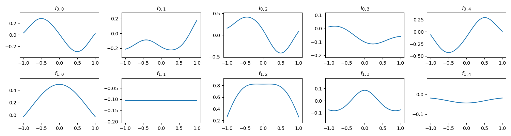
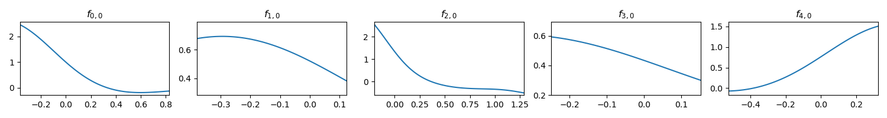
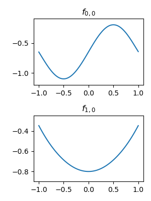
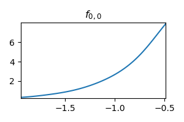

# FCN-KAN
Kolmogorov–Arnold Networks with modified activation (using FCN + positional encoding to represent the activation). The code utilizes `torch.vmap` to accelerate and simplify the process.

## Installation

```
pip install FCN_KAN
```

## Example usage

```python
from FCN_KAN import KANLayer

model = nn.Sequential(
        KANLayer(2, 5),
        KANLayer(5, 1)
    )

x = torch.randn(16, 2)
y = model(x)
# y.shape = (16, 1)
```

## Experiment

Running the following code for quick experiment:

```bash
python experiment.py
```

## Visualization

I experimented with a simple objective function:

```python
def target_fn(input):
    # f(x,y)=exp(sin(pi * x) + y^2)
    if len(input.shape) == 1:
        x, y = input
    else:
        x, y = input[:, 0], input[:, 1]
    return torch.exp(torch.sin(torch.pi * x) + y**2)
```

The first experiment set the network as:

```python
dims = [2, 5, 1]
model = nn.Sequential(
    KANLayer(dims[0], dims[1]),
    KANLayer(dims[1], dims[2])
)
```

After training on this, the activation function did learn the sine and square functions:



The exponential function is also been learned for the second layer:



For better interpretability, we can set the network as:

```python
dims = [2, 1, 1]
model = nn.Sequential(
    KANLayer(dims[0], dims[1]),
    KANLayer(dims[1], dims[2])
)
```

Both the first layer and the second layer learning exactly the target function:



Second layer learning the exponential function:

