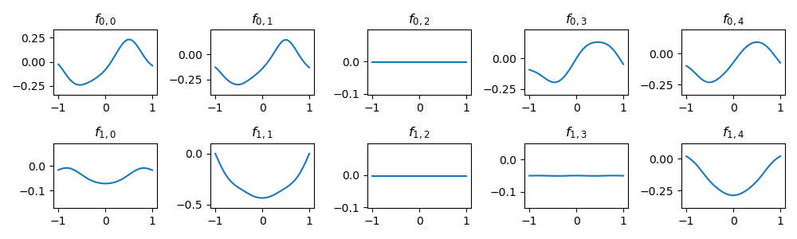
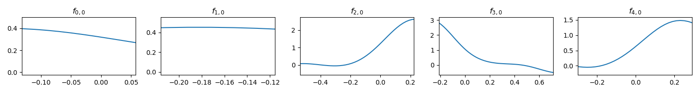

# FCN-KAN
Kolmogorov–Arnold Networks with modified activation (using FCN + positional encoding to represent the activation). The code utilizes `torch.vmap` to accelerate and simplify the process.

## Example usage

```python
from kan_layer import KANLayer

model = nn.Sequential(
        KANLayer(2, 5),
        KANLayer(5, 1)
    )

x = torch.randn(16, 2)
y = model(x)
# y.shape = (16, 1)
```

## Visualization

I experimented with a simple objective function:

```python
def target_fn(input):
    # f(x,y)=exp(sin(pi * x) + y^2)
    if len(input.shape) == 1:
        x, y = input
    else:
        x, y = input[:, 0], input[:, 1]
    return torch.exp(torch.sin(torch.pi * x) + y**2)
```

After training on this, the activation function did learn the sine and square functions:



However, the exponential function has not been learned for the second layer:


```
```